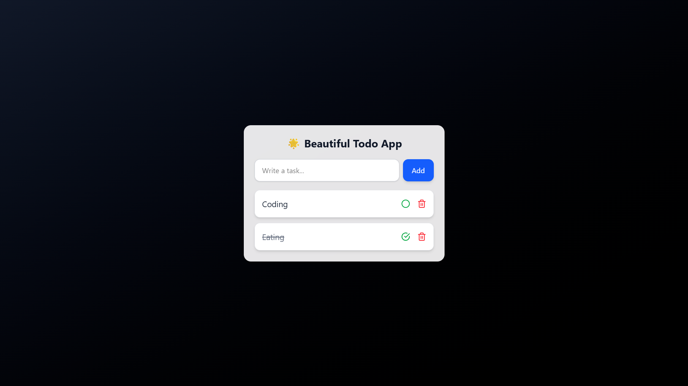

# 📘 Todo App — RTK Query + React + Tailwind + JSON Server

A beautiful and simple Todo App built using:

- ⚛️ React + TypeScript  
- 🎯 Redux Toolkit Query (RTK Query)  
- 🎨 TailwindCSS  
- 🗄️ JSON Server backend  

---

# 📸 Screenshots



---

# 🚀 Features

- Add Todo  
- Toggle Completed  
- Delete Todo  
- Fetch from JSON Server  
- Beautiful UI  
- Auto-refetch using RTK Query  
- No manual caching  

---

# 🛠 Installation

### 1️⃣ Install dependencies

```sh
npm install

npm run server
npm run dev

```